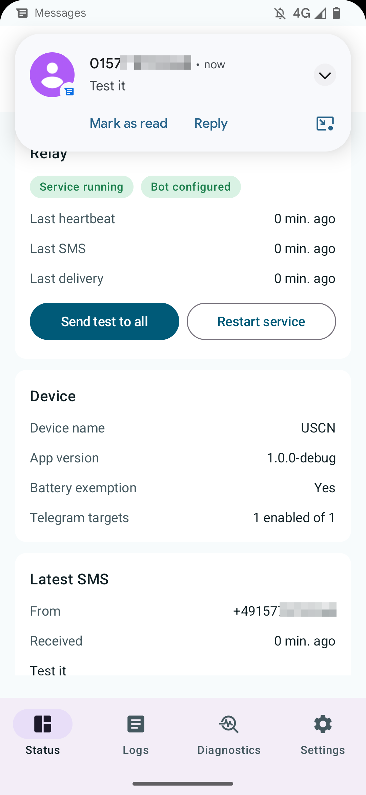
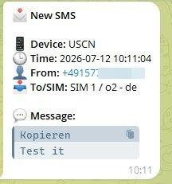
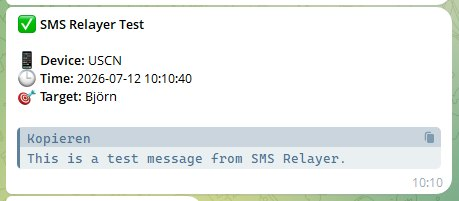
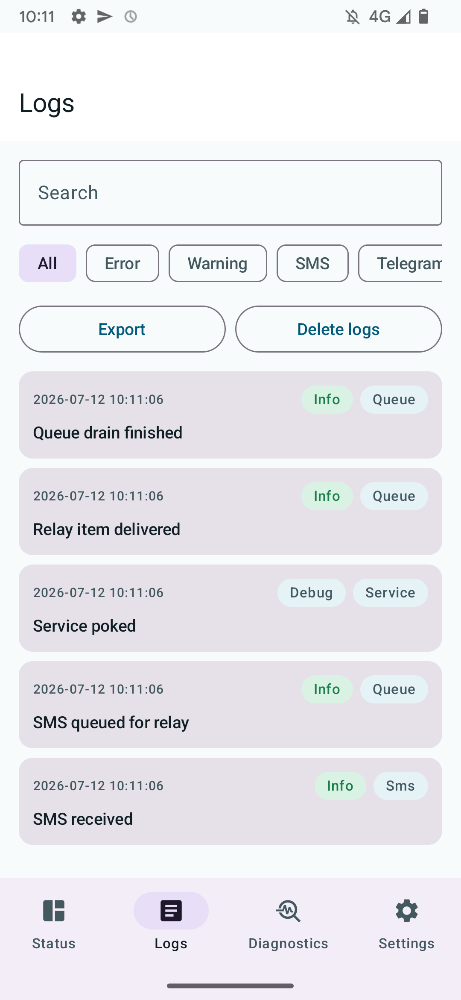
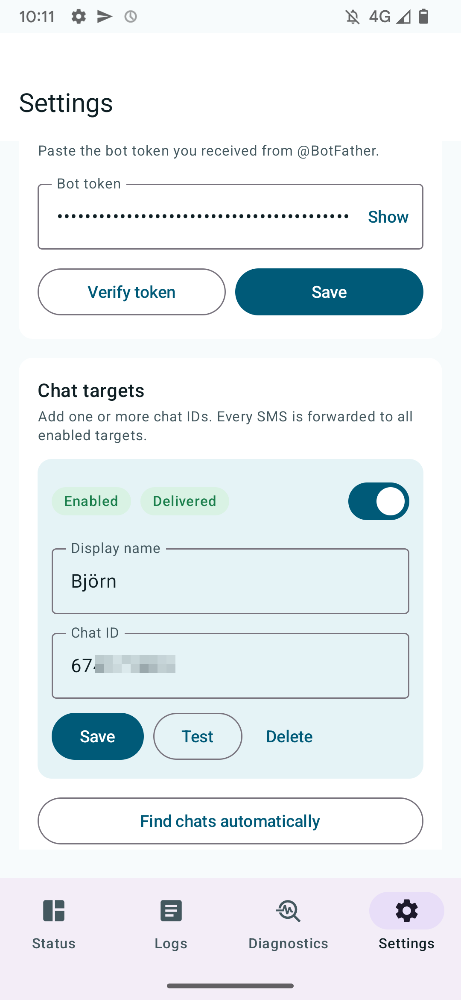
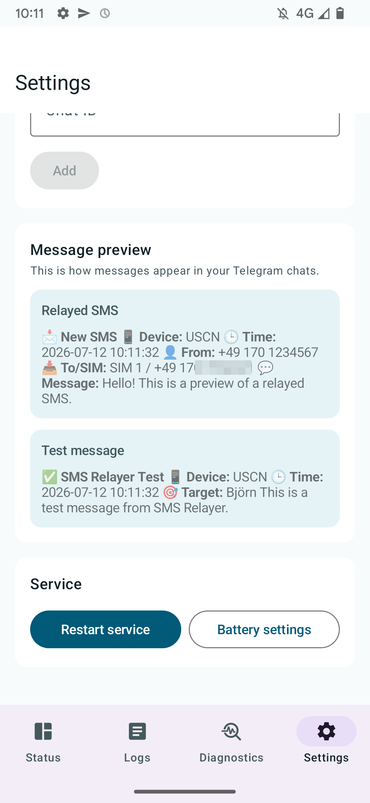
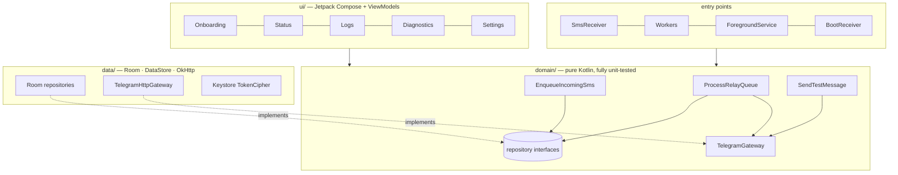

<div align="center">


# SMS Relayer

**Turn any spare Android phone into a reliable SMS-to-Telegram gateway.**

[](https://github.com/bjspi/sms-to-telegram/actions/workflows/android-ci.yml)
[](LICENSE)


</div>

---

SMS Relayer captures every incoming SMS on a dedicated Android device and forwards it — cleanly formatted, HTML-escaped, and retry-safe — to one or more Telegram chats. Built for the "old phone in a drawer" use case: a test SIM in the lab, a legacy number that still receives important codes, provider or monitoring SMS that should land in a team chat.

**No root required.** The app achieves 24/7 reliability purely with modern Android platform primitives: a `specialUse` foreground service, expedited WorkManager jobs, a persistent delivery queue, and a self-healing watchdog.

## Features

- 📩 **Capture & forward** — every incoming SMS is persisted first, then relayed to all enabled Telegram chats
- 🎯 **Multiple targets at once** — fan out every SMS to any mix of private chats, groups and channels simultaneously; each target is individually testable and toggleable
- 🔍 **Automatic chat-ID discovery** — no chat-ID hunting: message your bot once, tap *Find chats automatically*, and the app registers every chat the bot has seen
- ✅ **One-tap verification** — send a test message to a single target or to all of them and see per-target delivery results before going live
- 🔁 **Persistent delivery queue** — atomic claim semantics, escalating backoff (1 → 5 → 15 → 30 min), honors Telegram's `retry_after`, never silently drops a message
- 🛡️ **Self-healing runtime** — foreground service + periodic watchdog + boot receiver; recovers from process death, reboots, and app updates
- 🔐 **Encrypted secrets** — the bot token is encrypted at rest with an AES-256/GCM key in the Android Keystore and redacted from every log line
- 🩺 **Built-in diagnostics** — one screen answers "why isn't it relaying?": permissions, battery exemption, network, bot connectivity, queue health
- 🧾 **Structured logging** — searchable, filterable, exportable event log with automatic retention
- 🚀 **Guided onboarding** — every step is verified (token check, test delivery), so a finished setup is a working setup
- 🌍 **Localized** — English and German, including the relayed Telegram messages; switchable in-app (per-app language preference) or via system settings on Android 13+

## Screenshots

<div align="center">
  
  <br/>
  <sub><b>Live relay:</b> an SMS arrives (notification on top) while the status screen shows service, bot, heartbeat and queue at a glance.</sub>
</div>

&nbsp;

<div align="center">
  
  &nbsp;&nbsp;
  
  <br/>
  <sub><b>…seconds later in Telegram:</b> the relayed SMS with device, time, sender and SIM (left) — and an in-app test message for verifying every configured target (right).</sub>
</div>

&nbsp;

<table align="center">
  <tr>
    <td align="center">
      <br/>
      <sub>The delivery pipeline in the logs:<br/>received → queued → delivered</sub>
    </td>
    <td align="center">
      <br/>
      <sub>Chat targets with per-target test,<br/>toggle and automatic discovery</sub>
    </td>
    <td align="center">
      <br/>
      <sub>Live preview of exactly how<br/>messages render in Telegram</sub>
    </td>
  </tr>
</table>

## How it stays alive without root

Android aggressively restricts background work. SMS Relayer layers three sanctioned mechanisms so no single point of failure can lose a message:

| Layer | Mechanism | Role |
|---|---|---|
| Fast path | Foreground service (`specialUse` type) | Immediate delivery, heartbeat every 5 min, persistent notification |
| Guaranteed path | Expedited WorkManager job (network-constrained) | Survives process death & Doze; runs exactly when connectivity exists |
| Safety net | Periodic watchdog (15 min) + boot receiver | Restarts the service, recovers stale queue items, re-drains |

The delivery queue is the single source of truth: an SMS is written to Room *before* any network call, and queue items are claimed transactionally (`Pending → Sending` in one SQL transaction), so concurrent processors can never double-send. A failing chat never blocks the others — each target has its own queue item and its own retry schedule.

On Android 15+, where the common `dataSync` service type is capped at 6 h/day, the service runs as `specialUse` — the type designed for exactly this kind of long-lived, sideloaded utility.

### Rooted vs. non-rooted — what's the difference?

Root-based SMS gateways usually lean on a `su` daemon to brute-force their way past Android's background limits. SMS Relayer covers the same ground with sanctioned APIs:

| What root is typically used for | How SMS Relayer does it without root |
|---|---|
| Restart the app when the OS kills it | `START_STICKY` service + WorkManager watchdog + boot receiver |
| Run background work below the 15-min floor | 5-min heartbeat inside the foreground service; watchdog as the net |
| Punch through Doze / App Standby | Expedited, network-constrained WorkManager + battery-optimization exemption |
| Autostart after reboot | `BOOT_COMPLETED` (one of the few contexts still allowed to start a foreground service) |
| Never lose a message while "fighting" the OS | Not a root feature at all: the persistent queue stores every SMS *before* any send attempt |

What root would still buy you — and how much it matters here:

- **Recovery after a manual "Force stop".** No non-root app may restart itself after the user force-stops it; a rooted daemon could. In practice this is a non-issue for a dedicated relay device: nobody force-stops it, and even if it happens, the queue is persistent — every SMS received after the next launch or reboot is delivered, nothing already queued is lost.
- **Ignoring aggressive OEM task killers** (some Xiaomi/Huawei builds). The non-root answer is the battery exemption plus the OEM's autostart whitelist, which the onboarding points you to.

Everything else that root promises for this use case is already covered by the layers above — which is exactly why this app doesn't ask for it.

## Architecture

Clean, dependency-inverted layering with a single composition root — no DI framework magic, every dependency is an explicit constructor parameter.



```text
io.github.bjspi.smsrelayer/
├── app/         Application + MainActivity
├── di/          AppContainer — the composition root
├── domain/      models, repository interfaces, use cases, Telegram contract (pure Kotlin)
├── data/        Room database, DataStore settings, Keystore crypto, Bot API client
├── platform/    read-only system state (permissions, battery, network)
├── service/     foreground service, notifications, service controller
├── sms/         SMS broadcast receiver, PDU parser, dual-SIM resolver
├── work/        WorkManager: queue drain (expedited) + watchdog
└── ui/          Compose screens, one ViewModel per screen, StateFlow state
```

Key decisions and the reasoning behind them are documented in [`docs/ARCHITECTURE.md`](docs/ARCHITECTURE.md).

## Security & privacy

- The bot token never touches disk in plaintext — AES-256/GCM via Android Keystore, hardware-backed where available
- The token is redacted from every error message and log line (it is part of Bot API URLs)
- Logs store only an 80-character SMS preview; full bodies exist solely in the local Room database for delivery
- No analytics, no cloud backend, no third-party services — data flows from your SIM to your Telegram chat, nothing else
- `android:allowBackup="false"`, and only the minimum permission set is requested (no `READ_SMS`)

> ⚠️ SMS content can be sensitive (2FA codes!). Only relay to Telegram chats you fully control.

## Getting started

### 1. Create a Telegram bot

1. Open Telegram, talk to [`@BotFather`](https://t.me/BotFather), send `/newbot`
2. Pick a display name and a unique username ending in `bot`
3. Copy the token (`123456789:ABC…`) — treat it like a password

### 2. Install & onboard

Grab the latest signed APK from [**Releases**](https://github.com/bjspi/sms-to-telegram/releases) — or build it yourself:

```bash
git clone https://github.com/bjspi/sms-to-telegram.git
cd sms-to-telegram
./gradlew :app:assembleDebug
adb install -r app/build/outputs/apk/debug/app-debug.apk
```

The guided onboarding walks you through device naming, token verification, target selection, permissions, and a mandatory end-to-end test delivery.

### 3. Add your targets — no chat-ID hunting

You never have to dig chat IDs out of raw API responses:

1. Send your bot a direct message (or add it to a group and post anything there)
2. In the app, tap **Find chats automatically** — every chat the bot has seen shows up as a one-tap candidate
3. Repeat for as many targets as you like: private chats, groups and channels can be mixed freely, and **every enabled target receives each SMS simultaneously**

Before going live, hit **Send test to all**: the app pushes a clearly-marked test message through the real delivery path and shows the result per target, so you know every single chat is reachable. Once running, the relay lives behind a silent, persistent notification — visible if you look for it, never in your way.

### 4. Make it bulletproof (recommended)

For a dedicated relay device: grant the battery-optimization exemption during onboarding, allow autostart if your OEM (Xiaomi, Huawei, …) has a custom setting for it, and keep the device on a charger.

## Development

| Command | Purpose |
|---|---|
| `./gradlew :app:testDebugUnitTest` | JVM unit tests (domain logic, HTTP classification via MockWebServer) |
| `./gradlew :app:assembleDebug` | Debug build |
| `./gradlew :app:assembleRelease` | Minified release build (R8 + resource shrinking, ~1.8 MB) |
| `.\build-install.bat` | Windows convenience: build, install & launch via ADB |

**Stack:** Kotlin 2.0 · Jetpack Compose (Material 3) · Coroutines/Flow · Room · DataStore · WorkManager · OkHttp · kotlinx.serialization · Gradle version catalog

The domain layer is pure Kotlin with no Android dependencies — use cases, retry policy, message formatting, and the Telegram error-classification table are covered by fast JVM tests against in-memory fakes and a mock HTTP server.

CI builds and tests every push, produces a **signed, minified release APK** (keystore lives in GitHub secrets; builds without the secrets fall back to unsigned), and publishes the APK to a GitHub Release on every `v*` tag.

## License

[MIT](LICENSE) — do whatever you like, attribution appreciated.
